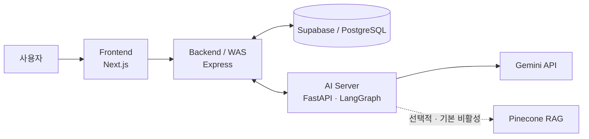

# HealthMate

**AI 기반 개인 건강 상태·성향 맞춤 생활 건강 코칭 서비스**

HealthMate는 건강 정보와 성향을 함께 고려해 운동·식단 코칭을 개인화하는 방법을 탐구한 **2026년 대학 심화캡스톤 팀 프로젝트**입니다.

이 저장소의 `portfolio/integration-runtime` 브랜치는 `portfolio/integration-quality@8c5fe5cf66d1322dc85703dffb3aa722e9358c5a`에서 직접 시작해 Phase 2C-1 runtime privacy·observability·retention 경계를 적용한 후보입니다. Frontend, Express Backend, Supabase migrations, FastAPI/LangGraph AI v2, deployment configuration이 함께 보존돼 있지만 완전히 검증된 운영 배포본을 뜻하지 않습니다.

## 프로젝트 핵심 정보

- 2026년 대학 심화캡스톤 팀 프로젝트
- 한국정보기술학회 논문 경진대회 **은상** 수상(팀 연구 성과)
- 저장소 소유자는 최종 논문 집필 담당 및 **제1저자**
- LangGraph 멀티에이전트 구조 공동 설계, FastAPI AI 서버 구현 참여
- Gemini 연동, 프롬프트 공동 설계, 평가 시나리오·테스트 방향·결과 분석
- Pinecone/RAG 초기 구현 후 팀원에게 인계

> 연구 배경과 논문 평가 결과는 최종 논문을, 현재 구현 범위와 실행 방법은 이 브랜치의 실제 코드와 설정을 기준으로 설명합니다. 논문에서 다룬 시스템과 이 코드 스냅샷은 완전히 동일한 배포본이 아닙니다.

## 프로젝트 목적

논문이 인용한 선행 연구에서는 mHealth·피트니스 앱 사용자의 약 70%가 설치 후 100일 이내 이탈하는 문제가 보고되었습니다. 이는 HealthMate에서 직접 측정한 수치가 아니라 연구 배경으로 인용한 외부 연구 결과입니다.

HealthMate는 단순 신체 정보 중심 추천을 넘어 다음을 탐구했습니다.

- 건강 상태, 목표, 활동 수준, 알레르기, 부상 이력을 반영한 운동·식단 코칭
- MBTI와 DISC를 진단이 아닌 개인화 보조 신호로 활용하는 방법
- 대화와 사용자 기록을 누적해 응답을 조정하는 점진적 개인화
- 위험 운동, 극단 식단, 알레르기 충돌을 줄이기 위한 제약·검증 구조

HealthMate는 의료 진단·처방 서비스가 아닙니다. AI 응답은 생활 건강 코칭 참고 정보이며, 의료적 판단이 필요하면 의료 전문가의 진료가 우선합니다.

## 아키텍처

기본 요청 흐름은 `Frontend → Express Backend → FastAPI/LangGraph → Gemini API`입니다. Backend는 인증과 데이터 경계를 담당하고, 사용자·프로필·채팅·플랜 데이터는 Supabase/PostgreSQL에 저장합니다. AI Server는 프로필 제약을 읽어 생성 전후 검증에 사용합니다.

현재 빠른 채팅 그래프는 프로필 제약과 결과 검증을 중심으로 동작합니다. 논문에 포함된 Pinecone 장기 기억 관련 코드와 평가 자산은 남아 있지만 RAG는 기본 비활성이고 현재 fast graph의 기본 경로와 동일하지 않습니다.

## 현재 브랜치의 코드 범위

| 영역 | 위치 | 확인되는 범위 |
| --- | --- | --- |
| Frontend | [`develop/frontend-ui`](develop/frontend-ui) | Next.js 16, 인증·온보딩·홈·프로필·AI 채팅·캘린더형 플랜 |
| Backend / WAS | [`develop/backend-api`](develop/backend-api) | Express, JWT, Supabase, 채팅·플랜 저장, AI 요청 중계 |
| AI v2 | [`develop/ai-model/v2`](develop/ai-model/v2) | FastAPI, LangGraph, Gemini, 프로필 제약·검증, 평가 스크립트 |
| AI v1 | [`develop/ai-model/v1`](develop/ai-model/v1) | 레거시 API와 초기 구현 이력 |
| Database | [`develop/backend-api/supabase/migrations`](develop/backend-api/supabase/migrations) | 추적된 Supabase SQL migrations |
| Deployment | [`develop/deploy`](develop/deploy) | GCP 2-VM, Docker Compose, Caddy, GitHub Actions 설정 |

저장소 루트에는 세 서비스를 한 번에 시작하는 명령이나 통합 Compose가 없습니다. 서비스별 준비와 실행은 [로컬 실행 가이드](docs/LOCAL_SETUP.md)를 따르세요.

### Phase 2B-1 보안 경계 (현재 코드 범위)

- Backend는 `JWT_SECRET`과 `INTERNAL_API_KEY`가 비어 있지 않고 example/placeholder 값이 아닌 경우에만 시작합니다. Production에서는 각 값이 최소 32자여야 합니다.
- JWT는 중앙 `JWT_SECRET`로 HS256 서명·검증하고 browser 요청은 `Authorization: Bearer <JWT>`를 사용합니다. Backend와 AI Server는 같은 `INTERNAL_API_KEY`를 `x-api-key`로 공유하며 Backend→AI 호출에도 항상 전달합니다.
- CORS는 정확한 쉼표 구분 origin allowlist를 사용하고 credentials는 허용하지 않습니다. Development/local에서 allowlist를 생략하면 localhost 기본값을 사용하며 production에서는 명시값이 필요합니다.
- AI debug/observability route는 기본 비활성이고 development/local에서만 명시적으로 켤 수 있습니다. 현재 `/api/v1/ai` legacy 경로는 v2 계약과 현재 callsite가 없어 정적 410, role source가 없는 `/api/v1/admin`은 정적 404를 반환합니다. Readiness는 coarse/redacted 상태만 반환하며 rate limit은 signup/login에만 적용됩니다.

이는 Phase 2B-1의 구현 경계를 설명하는 것이며 운영 배포 완료나 최종 통합 검증을 선언하는 내용은 아닙니다.

### Phase 2B-2 품질·tenant 경계 (현재 코드 범위)

- 기존 AI 실패 3건은 현재 fast graph와 계약을 기준으로 다시 판정했습니다. 삭제된 route import, 과거 응답 문자열 기대, 고정 과거 날짜 fixture는 test drift였고, 그 과정에서 발견한 malformed mixed proposal 재사용 결함은 shared state guard에서 수정했습니다.
- 공개 `session_id`는 API 계약에 그대로 두되 AI checkpoint·lock key는 `user_id + session_id`의 opaque hash로 분리합니다. Backend feedback은 인증 사용자가 소유한 저장 message만 사용하므로 다른 사용자의 session/message 내용으로 피드백을 조작할 수 없습니다.
- Frontend에는 Supabase client가 없고 사용자 요청은 service-role Backend를 통과합니다. 따라서 현재 tenant 경계는 Backend의 JWT·ownership filter이며, 이 구조에서 RLS 부재 자체를 구현 결함으로 보지는 않습니다.
- Backend production dependency audit 9건은 현재 major 범위의 lockfile 갱신으로 0건이 됐습니다. AI Dockerfile 대상인 Python 3.11은 로컬에 없어 3.11 설치·lock 검증은 수행하지 않았습니다.

### Phase 2C-1 runtime privacy·retention 경계 (현재 코드 범위)

- AI TraceStore는 production/default에서 raw user/session identifier, message, request·response body, health profile, plan snapshot과 상세 event/log를 저장하지 않고 상태·시간·지연·count 중심 summary만 보존합니다. `TRACE_RETENTION_MINUTES` 기본값은 60분입니다. Development/local에서도 `ENABLE_DEBUG_ROUTES=true`를 명시해야 상세 trace가 활성화되며, nested object/list와 문자열 credential은 고정 `[REDACTED]` 값으로 치환됩니다.
- Backend Winston 파일은 `error.log`와 `combined.log` 각각 5 MiB × 5개로 제한됩니다. Morgan은 method, query 없는 path, status, response time만 기록하고 Authorization/Cookie header는 기록하지 않습니다. Chat/home gateway와 공통 error handler는 raw upstream payload·stack·내부 message를 client에 반환하지 않습니다.
- 기존 raw-key checkpoint는 저장 state에서 owner를 신뢰성 있게 증명할 수 없어 자동 fallback/rekey하지 않습니다. Upgrade 시 activity가 없던 row에는 새 72시간 만료 시계를 부여하고, cleanup은 live session lock을 건드리지 않으며 durable WAS outbox를 삭제하지 않습니다. Supabase 제품 데이터에는 retention migration을 추가하지 않았습니다.

## 주요 기능

| 기능 | 현재 코드에서 확인되는 범위 |
| --- | --- |
| 계정·프로필 | 회원가입·로그인, JWT 인증, 신체·건강·목표·MBTI 정보 저장 |
| 홈 건강관리 | 운동·식단 추천, 수분·활동 위젯, 캘린더형 플랜 조회·수정 |
| AI 채팅 | Express를 경유하는 FastAPI `/chat` 연동과 LangGraph 상태 그래프 |
| 개인화·안전 | 알레르기·부상·질환·목표를 반영하는 프로필 제약과 플랜 검증 |
| 플랜 반영 | AI 플랜 제안·수정·승인 후 Backend를 통한 저장 |
| 기록·피드백 | 채팅 스레드 조회·삭제와 답변 좋아요/싫어요 피드백 저장 |

## 나의 주요 기여

> 팀 프로젝트이며 Frontend·Backend·AI 전체 시스템 또는 AI 아키텍처의 초기 설계와 최종 구현을 한 사람이 단독 수행한 프로젝트가 아닙니다.

- LangGraph 기반 멀티에이전트 구조 공동 설계
- FastAPI 기반 AI 서버 구현 참여
- Gemini API 연동
- 프롬프트 설계 공동 수행
- Pinecone/RAG 초기 구현 담당 후 팀원에게 인계
- 정상·위험·개인화 평가 시나리오 설계
- 테스트 진행 방향 수립 및 결과 분석
- 관련 연구 및 선행 사례 조사
- 논문 집필 및 제1저자

FastAPI 구현 과정에서는 생성형 AI를 보조 도구로 사용했습니다. 평가에서는 단일 정확도 수치 대신 정상 요청 수용, 위험 요청 거부, 성격별 응답 차이, 누적 정보 반영을 분리해 시나리오와 판정 기준을 구성했습니다.

## 기술 스택

| 영역 | 기술 |
| --- | --- |
| Frontend | Next.js 16, React 19, TypeScript 5, Tailwind CSS 4, Framer Motion |
| Backend | Node.js, Express 4, Supabase/PostgreSQL, JWT, Axios |
| AI | Python 3.11 대상, FastAPI, LangGraph, Gemini API, Pydantic, httpx |
| Memory·관측 | SQLite Checkpointer, Pinecone(선택적), LangSmith(선택적) |
| Infra | Docker, Docker Compose, Caddy, GitHub Actions, Vercel, GCP 배포 설정 |

논문 평가에는 Gemini 2.5 Flash가 사용되었다고 보고되어 있지만 AI v2는 모델명을 환경변수로 설정합니다. 논문 시점과 현재 코드의 모델 구성을 동일한 것으로 간주하지 않습니다.

## 검증 상태

Phase 2C-1에서는 credential·tracing·RAG를 끄고 네트워크가 차단된 disposable AI copy에서 다음을 확인했습니다.

- Frontend: clean `npm ci`, lint 오류 0·기존 경고 2, production build, display contract 7/7 통과
- Backend: clean `npm ci`, contracts 21/21, security 33/33, tenant 8/8, logging privacy, JavaScript 구문 38/38, production audit 0건
- AI: Python 3.12.13 구문 103/103, metadata 44/44, intent 57/57, routing 12/12, fast plan 110/110, quality 3/3, quality guards 94/94, mixed WAS edge case, chat E2E와 security 13/13 통과
- 신규 runtime privacy/retention 검사는 3개 entrypoint·5개 top-level case/scenario로 구성되며 TraceStore 3/3, Backend logging 1/1, SQLite checkpoint retention 1/1이 통과했습니다. Checkpoint 검사는 정확한 72시간 경계, live lock, pending outbox, activity 없는 legacy row, 1,001개 초과 배치 삭제를 포함합니다.

Backend 8개와 AI 동일 공개 session A/B 격리 1개를 합쳐 tenant 회귀 시나리오 9/9가 유지됐습니다. 실제 Supabase·Gemini·Pinecone·LangSmith 또는 운영 endpoint는 호출하지 않았습니다. Dockerfile 대상 Python 3.11은 이 환경에 없어 3.11 결과나 lock을 주장하지 않습니다. Frontend home recommendation browser smoke는 설치된 browser executable이 없어 `NOT RUN`이며, 나머지 상세 결과는 [구현 상세 노트](docs/IMPLEMENTATION_NOTES.md)에 기록합니다. 재현 명령은 [로컬 실행 가이드](docs/LOCAL_SETUP.md)에 있습니다.

## 논문 평가 결과

다음은 현재 브랜치의 회귀 테스트 결과가 아니라 **최종 논문에 보고된 제한된 사전 시나리오 기반 예비 평가**입니다.

| 평가 항목 | 평가 범위 | 논문 보고 결과 |
| --- | ---: | ---: |
| 정상 시나리오 | 운동·식단 각 15건 | 30/30 통과 |
| 위험 시나리오 | 부상·심혈관·알레르기·극단 식단 각 5건 | 20/20 거부 |
| 거짓 양성 / 거짓 음성 | 위 50개 안전성 시나리오 | 0건 / 0건 |
| 성격 차별화 | 외향형·내향형 각 2개 프롬프트 | 적합성 0.90 |
| 누적 정보 반영 | 단일 시나리오 10턴 | 정확도 0.90 |

이 결과는 임상적 안전성, 실제 건강 개선, 사용자 이탈률 감소 또는 다양한 사용자 집단에 대한 일반화 성능을 입증하지 않습니다.

## 논문 및 성과

- 조승훈, 박현민, 김찬, 박현성, 이유한, 김승호, 이한용, 「AI기반 개인 건강 상태 및 성향 맞춤 건강관리 서비스 ‘헬스메이트’ 개발」, 2026 한국정보기술학회 하계 종합학술대회 논문집, pp. 1193–1197
- 저장소 소유자: 논문 집필 담당 및 제1저자
- 한국정보기술학회 논문 경진대회 **은상** 수상(팀 연구 성과)

## 실행 방법

환경변수, Supabase 요구사항, Frontend·Backend·AI Server의 개별 실행 순서는 [LOCAL_SETUP.md](docs/LOCAL_SETUP.md)를 참고하세요. 실제 secret은 커밋하지 말고 각 구성 요소의 `.env.example` placeholder를 로컬 환경파일에 복사해 교체해야 합니다.

## 현재 한계

- 이 브랜치는 runtime integration candidate이며 운영 준비 완료를 의미하지 않습니다.
- 논문 시점의 시스템과 현재 코드 스냅샷은 배포 환경, AI 그래프, 기억 경로 등에서 차이가 있습니다.
- AI v2 의존성은 하한 버전 중심이고 Python 3.11에서 검증한 lockfile이 없어 설치 시점별 차이가 생길 수 있습니다.
- Tenant-scoped checkpoint key로 전환하기 전에 생성된 raw `session_id` checkpoint는 보안상 fallback·자동 migration하지 않으며 72시간 activity TTL 또는 명시적 offline purge로 제거합니다. 그 세션의 자동 연속성은 제공하지 않습니다.
- Product DB의 chat/profile/plan lifecycle과 운영 중앙 로그 수집·삭제 정책은 이번 local runtime hardening 범위 밖이며 별도 정책이 필요합니다.
- Frontend browser smoke는 이 검증 환경에 Playwright browser executable이 없어 실행하지 못했습니다.
- Supabase 프로젝트의 실제 migration 적용 상태와 외부 서비스의 현재 가용성은 저장소만으로 확인할 수 없습니다.
- GCP 배포 설정은 보존돼 있지만 현재 라이브 서비스나 배포 성공을 보장하지 않습니다.
- MBTI 16유형 × DISC 4유형 전체, 모호한 경계 사례, 실제 리텐션 개선 RCT는 검증하지 못했습니다.
- 저장소에는 `LICENSE` 파일이 없어 재사용·배포 조건이 명시되어 있지 않습니다.

## 상세 문서

- [구현 상세 노트](docs/IMPLEMENTATION_NOTES.md): 브랜치 provenance, 논문–코드 차이, 보안 history, 기술부채와 미검증 항목
- [로컬 실행 가이드](docs/LOCAL_SETUP.md): 서비스별 설정, placeholder 환경변수, Supabase와 선택적 외부 연동

## 프로젝트 성격 / provenance

이 저장소는 [팀 원본 저장소](https://github.com/WinLike-dev/capstone_2team)를 개인 포트폴리오 관점에서 정리한 Fork입니다. 전체 AI 구조의 초기 설계는 다른 팀원이 주도했고, 이후 LangGraph 구조와 FastAPI 구현은 공동 작업으로 진행했습니다. API 연동은 각 팀원이 자신의 담당 영역에서 수행했습니다.
