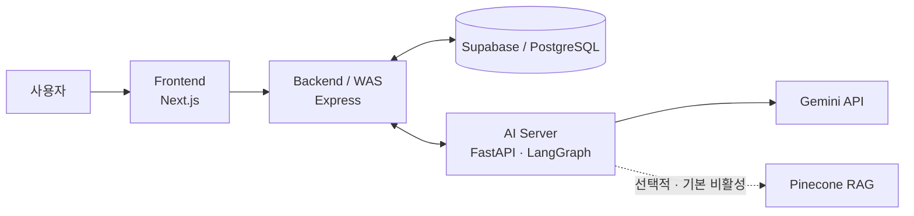

# HealthMate

**AI 기반 개인 건강 상태·성향 맞춤 생활 건강 코칭 서비스**

HealthMate는 건강 정보와 성향을 함께 고려해 운동·식단 코칭을 개인화하는 방법을 탐구한 **2026년 대학 심화캡스톤 팀 프로젝트**입니다.

이 저장소의 `portfolio/integration-candidate` 브랜치에는 Frontend, Express Backend, Supabase migrations, FastAPI/LangGraph AI v2, deployment configuration이 함께 보존되어 있습니다. 통합 범위를 검토하기 위한 후보 스냅샷이며, 완전히 검증된 운영 배포본을 뜻하지 않습니다.

## 프로젝트 핵심 정보

- 2026년 대학 심화캡스톤 팀 프로젝트
- 한국정보기술학회 논문 경진대회 **은상** 수상(팀 연구 성과)
- 저장소 소유자는 최종 논문 집필 담당 및 **제1저자**
- LangGraph 멀티에이전트 구조 공동 설계, FastAPI AI 서버 구현 참여
- Gemini 연동, 프롬프트 공동 설계, 평가 시나리오·테스트 방향·결과 분석
- Pinecone/RAG 초기 구현 후 팀원에게 인계

> 연구 배경과 논문 평가 결과는 최종 논문을, 현재 구현 범위와 실행 방법은 이 브랜치의 실제 코드와 설정을 기준으로 설명합니다. 논문에서 다룬 시스템과 이 코드 스냅샷은 완전히 동일한 배포본이 아닙니다.

## 프로젝트 목적

논문이 인용한 선행 연구에서는 mHealth·피트니스 앱 사용자의 약 70%가 설치 후 100일 이내 이탈하는 문제가 보고되었습니다. 이는 HealthMate에서 직접 측정한 수치가 아니라 연구 배경으로 인용한 외부 연구 결과입니다.

HealthMate는 단순 신체 정보 중심 추천을 넘어 다음을 탐구했습니다.

- 건강 상태, 목표, 활동 수준, 알레르기, 부상 이력을 반영한 운동·식단 코칭
- MBTI와 DISC를 진단이 아닌 개인화 보조 신호로 활용하는 방법
- 대화와 사용자 기록을 누적해 응답을 조정하는 점진적 개인화
- 위험 운동, 극단 식단, 알레르기 충돌을 줄이기 위한 제약·검증 구조

HealthMate는 의료 진단·처방 서비스가 아닙니다. AI 응답은 생활 건강 코칭 참고 정보이며, 의료적 판단이 필요하면 의료 전문가의 진료가 우선합니다.

## 아키텍처

기본 요청 흐름은 `Frontend → Express Backend → FastAPI/LangGraph → Gemini API`입니다. Backend는 인증과 데이터 경계를 담당하고, 사용자·프로필·채팅·플랜 데이터는 Supabase/PostgreSQL에 저장합니다. AI Server는 프로필 제약을 읽어 생성 전후 검증에 사용합니다.

현재 빠른 채팅 그래프는 프로필 제약과 결과 검증을 중심으로 동작합니다. 논문에 포함된 Pinecone 장기 기억 관련 코드와 평가 자산은 남아 있지만 RAG는 기본 비활성이고 현재 fast graph의 기본 경로와 동일하지 않습니다.

## 현재 브랜치의 코드 범위

| 영역 | 위치 | 확인되는 범위 |
| --- | --- | --- |
| Frontend | [`develop/frontend-ui`](develop/frontend-ui) | Next.js 16, 인증·온보딩·홈·프로필·AI 채팅·캘린더형 플랜 |
| Backend / WAS | [`develop/backend-api`](develop/backend-api) | Express, JWT, Supabase, 채팅·플랜 저장, AI 요청 중계 |
| AI v2 | [`develop/ai-model/v2`](develop/ai-model/v2) | FastAPI, LangGraph, Gemini, 프로필 제약·검증, 평가 스크립트 |
| AI v1 | [`develop/ai-model/v1`](develop/ai-model/v1) | 레거시 API와 초기 구현 이력 |
| Database | [`develop/backend-api/supabase/migrations`](develop/backend-api/supabase/migrations) | 추적된 Supabase SQL migrations |
| Deployment | [`develop/deploy`](develop/deploy) | GCP 2-VM, Docker Compose, Caddy, GitHub Actions 설정 |

저장소 루트에는 세 서비스를 한 번에 시작하는 명령이나 통합 Compose가 없습니다. 서비스별 준비와 실행은 [로컬 실행 가이드](docs/LOCAL_SETUP.md)를 따르세요.

## 주요 기능

| 기능 | 현재 코드에서 확인되는 범위 |
| --- | --- |
| 계정·프로필 | 회원가입·로그인, JWT 인증, 신체·건강·목표·MBTI 정보 저장 |
| 홈 건강관리 | 운동·식단 추천, 수분·활동 위젯, 캘린더형 플랜 조회·수정 |
| AI 채팅 | Express를 경유하는 FastAPI `/chat` 연동과 LangGraph 상태 그래프 |
| 개인화·안전 | 알레르기·부상·질환·목표를 반영하는 프로필 제약과 플랜 검증 |
| 플랜 반영 | AI 플랜 제안·수정·승인 후 Backend를 통한 저장 |
| 기록·피드백 | 채팅 스레드 조회·삭제와 답변 좋아요/싫어요 피드백 저장 |

## 나의 주요 기여

> 팀 프로젝트이며 Frontend·Backend·AI 전체 시스템 또는 AI 아키텍처의 초기 설계와 최종 구현을 한 사람이 단독 수행한 프로젝트가 아닙니다.

- LangGraph 기반 멀티에이전트 구조 공동 설계
- FastAPI 기반 AI 서버 구현 참여
- Gemini API 연동
- 프롬프트 설계 공동 수행
- Pinecone/RAG 초기 구현 담당 후 팀원에게 인계
- 정상·위험·개인화 평가 시나리오 설계
- 테스트 진행 방향 수립 및 결과 분석
- 관련 연구 및 선행 사례 조사
- 논문 집필 및 제1저자

FastAPI 구현 과정에서는 생성형 AI를 보조 도구로 사용했습니다. 평가에서는 단일 정확도 수치 대신 정상 요청 수용, 위험 요청 거부, 성격별 응답 차이, 누적 정보 반영을 분리해 시나리오와 판정 기준을 구성했습니다.

## 기술 스택

| 영역 | 기술 |
| --- | --- |
| Frontend | Next.js 16, React 19, TypeScript 5, Tailwind CSS 4, Framer Motion |
| Backend | Node.js, Express 4, Supabase/PostgreSQL, JWT, Axios |
| AI | Python 3.11 대상, FastAPI, LangGraph, Gemini API, Pydantic, httpx |
| Memory·관측 | SQLite Checkpointer, Pinecone(선택적), LangSmith(선택적) |
| Infra | Docker, Docker Compose, Caddy, GitHub Actions, Vercel, GCP 배포 설정 |

논문 평가에는 Gemini 2.5 Flash가 사용되었다고 보고되어 있지만 AI v2는 모델명을 환경변수로 설정합니다. 논문 시점과 현재 코드의 모델 구성을 동일한 것으로 간주하지 않습니다.

## 검증 상태

Phase 2A에서는 credential 없이 안전하게 실행 가능한 범위에서 다음을 확인했습니다.

- Frontend: `npm ci`, lint(오류 0·경고 2), production build, display contract 7/7 통과
- Backend: `npm ci`, internal contracts 21/21, JavaScript 33개 정적 구문 검사 통과
- AI: Python 100개 구문 검사, metadata 44/44, intent 57/57, routing 12/12, fast plan flow 110/110, quality evaluation 2/2 통과

알려진 AI 테스트 실패 3건은 이 문서·hygiene 단계에서 수정하지 않았습니다. AI 검사는 credential을 비우고 tracing을 끈 격리 환경에서 수행했으며 실제 Supabase·Gemini·Pinecone·LangSmith 또는 운영 endpoint를 호출하지 않았습니다. Python 검사는 제공된 3.12 runtime에서 수행돼 Dockerfile의 3.11 환경과 정확히 같지는 않습니다. 상세 결과와 기존 한계는 [구현 상세 노트](docs/IMPLEMENTATION_NOTES.md)에 기록합니다.

## 논문 평가 결과

다음은 현재 브랜치의 회귀 테스트 결과가 아니라 **최종 논문에 보고된 제한된 사전 시나리오 기반 예비 평가**입니다.

| 평가 항목 | 평가 범위 | 논문 보고 결과 |
| --- | ---: | ---: |
| 정상 시나리오 | 운동·식단 각 15건 | 30/30 통과 |
| 위험 시나리오 | 부상·심혈관·알레르기·극단 식단 각 5건 | 20/20 거부 |
| 거짓 양성 / 거짓 음성 | 위 50개 안전성 시나리오 | 0건 / 0건 |
| 성격 차별화 | 외향형·내향형 각 2개 프롬프트 | 적합성 0.90 |
| 누적 정보 반영 | 단일 시나리오 10턴 | 정확도 0.90 |

이 결과는 임상적 안전성, 실제 건강 개선, 사용자 이탈률 감소 또는 다양한 사용자 집단에 대한 일반화 성능을 입증하지 않습니다.

## 논문 및 성과

- 조승훈, 박현민, 김찬, 박현성, 이유한, 김승호, 이한용, 「AI기반 개인 건강 상태 및 성향 맞춤 건강관리 서비스 ‘헬스메이트’ 개발」, 2026 한국정보기술학회 하계 종합학술대회 논문집, pp. 1193–1197
- 저장소 소유자: 논문 집필 담당 및 제1저자
- 한국정보기술학회 논문 경진대회 **은상** 수상(팀 연구 성과)

## 실행 방법

환경변수, Supabase 요구사항, Frontend·Backend·AI Server의 개별 실행 순서는 [LOCAL_SETUP.md](docs/LOCAL_SETUP.md)를 참고하세요. 실제 secret은 커밋하지 말고 각 구성 요소의 `.env.example` placeholder를 로컬 환경파일에 복사해 교체해야 합니다.

## 현재 한계

- 이 브랜치는 integration candidate이며 운영 준비 완료를 의미하지 않습니다.
- 논문 시점의 시스템과 현재 코드 스냅샷은 배포 환경, AI 그래프, 기억 경로 등에서 차이가 있습니다.
- 알려진 AI 회귀 테스트 실패와 보안 경계 검토 항목이 남아 있습니다.
- AI v2 의존성은 하한 버전 중심이고 Python lockfile이 없어 설치 시점별 차이가 생길 수 있습니다.
- Supabase 프로젝트의 실제 migration 적용 상태와 외부 서비스의 현재 가용성은 저장소만으로 확인할 수 없습니다.
- GCP 배포 설정은 보존돼 있지만 현재 라이브 서비스나 배포 성공을 보장하지 않습니다.
- MBTI 16유형 × DISC 4유형 전체, 모호한 경계 사례, 실제 리텐션 개선 RCT는 검증하지 못했습니다.
- 저장소에는 `LICENSE` 파일이 없어 재사용·배포 조건이 명시되어 있지 않습니다.

## 상세 문서

- [구현 상세 노트](docs/IMPLEMENTATION_NOTES.md): 브랜치 provenance, 논문–코드 차이, 보안 history, 기술부채와 미검증 항목
- [로컬 실행 가이드](docs/LOCAL_SETUP.md): 서비스별 설정, placeholder 환경변수, Supabase와 선택적 외부 연동

## 프로젝트 성격 / provenance

이 저장소는 [팀 원본 저장소](https://github.com/WinLike-dev/capstone_2team)를 개인 포트폴리오 관점에서 정리한 Fork입니다. 전체 AI 구조의 초기 설계는 다른 팀원이 주도했고, 이후 LangGraph 구조와 FastAPI 구현은 공동 작업으로 진행했습니다. API 연동은 각 팀원이 자신의 담당 영역에서 수행했습니다.
