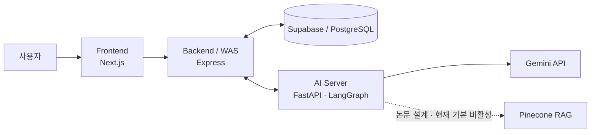

# HealthMate

**AI 기반 개인 건강 상태·성향 맞춤 생활 건강 코칭 서비스**

HealthMate는 건강 정보와 성향을 함께 고려해 운동·식단 코칭을 개인화하는 방법을 탐구한 2026년 대학 심화캡스톤 팀 프로젝트입니다.

### 프로젝트 핵심 정보

- 2026년 대학 심화캡스톤 팀 프로젝트
- 한국정보기술학회 논문 경진대회 **은상** 수상(팀 연구 성과)
- 최종 논문 집필 및 **제1저자**
- LangGraph 멀티에이전트 구조 공동 설계, FastAPI AI 서버 구현 참여
- 평가 시나리오 설계·테스트 방향 수립·결과 분석
- 관련 연구 및 선행 사례 조사

> 연구 배경·평가 결과는 최종 논문을, 구현 범위·기술 스택은 저장소의 실제 코드와 설정을 기준으로 작성했습니다. 기본 브랜치 `main`은 프론트엔드 프로토타입이며, 프론트엔드·백엔드·AI 통합 코드는 `test/all`에 보존되어 있습니다.

## 프로젝트 목적

논문이 인용한 선행 연구에서는 mHealth·피트니스 앱 사용자의 약 70%가 설치 후 100일 이내 이탈하는 문제가 보고되었습니다. 이는 HealthMate에서 직접 측정한 수치가 아니라 연구 배경으로 인용한 외부 연구 결과입니다.

HealthMate는 단순 신체 정보 중심 추천을 넘어 다음을 탐구했습니다.

- 건강 상태, 목표, 활동 수준, 알레르기, 부상 이력을 반영한 운동·식단 코칭
- MBTI와 DISC를 진단이 아닌 개인화 보조 신호로 활용하는 방법
- 대화와 사용자 기록을 누적해 응답을 조정하는 점진적 개인화
- 위험 운동, 극단 식단, 알레르기 충돌을 줄이기 위한 제약·검증 구조

HealthMate는 의료 진단·처방 서비스가 아니라 **생활 건강 코칭 가이드**를 목표로 합니다.

## 전체 아키텍처



논문은 Next.js–Node.js–FastAPI의 3계층 구조와 LangGraph 멀티에이전트, Pinecone 영구 기억을 포함한 전체 시스템을 설명합니다. 현재 `test/all`의 빠른 채팅 경로는 프로필 제약과 검증을 중심으로 동작하며 RAG는 기본 비활성입니다.

통합 코드의 기본 요청 흐름은 `Frontend → Express Backend → FastAPI/LangGraph → Gemini API`입니다. 사용자·프로필·채팅·플랜 데이터는 Supabase/PostgreSQL에 저장하고, AI 서버는 필요한 프로필을 Backend에서 읽어 제약 조건과 응답 생성에 사용합니다. `main`에는 이 중 프론트엔드만 포함됩니다.

통합 코드에서 확인되는 핵심 설계 의도는 다음과 같습니다.

- Frontend가 AI 서버를 직접 호출하지 않고 Express를 인증·데이터 경계로 사용
- 생성 전 사용자 프로필에서 알레르기·부상·질환·목표 제약을 추출
- 생성 결과를 validator에서 확인한 뒤 응답과 저장 가능한 플랜으로 확정
- 대화 응답과 캘린더 반영을 분리해 사용자의 승인 후 플랜 저장

## 주요 기능

가장 넓은 구현이 보존된 `test/all` 통합 코드에서 다음 기능을 확인할 수 있습니다.

| 기능 | 코드에서 확인되는 범위 |
| --- | --- |
| 계정·프로필 | 회원가입·로그인, JWT 인증, 신체·건강·목표·MBTI 정보 저장 |
| 홈 건강관리 | 운동·식단 추천, 수분·활동 위젯, 캘린더형 플랜 조회·수정 |
| AI 채팅 | Express를 경유하는 FastAPI `/chat` 연동과 LangGraph 상태 그래프 |
| 개인화·안전 | 알레르기·부상·질환·목표를 반영하는 프로필 제약과 플랜 검증 |
| 플랜 반영 | AI 플랜 제안·수정·승인 후 Backend를 통한 저장 |
| 기록·피드백 | 채팅 스레드 조회·삭제와 답변 좋아요/싫어요 피드백 저장 |

`main`에는 온보딩, 홈, 추천, 채팅, 프로필 화면이 있으나 일부 데이터와 응답은 목업입니다.

주요 코드 위치:

- `main` 프론트엔드: [`develop/frontend-ui`](develop/frontend-ui)
- `test/all` 백엔드: [`develop/backend-api`](https://github.com/Jossi02/healthmate-ai-healthcare/tree/test/all/develop/backend-api)
- `test/all` AI v2: [`develop/ai-model/v2`](https://github.com/Jossi02/healthmate-ai-healthcare/tree/test/all/develop/ai-model/v2)
- `test/all` Supabase 마이그레이션: [`supabase/migrations`](https://github.com/Jossi02/healthmate-ai-healthcare/tree/test/all/develop/backend-api/supabase/migrations)

## 나의 주요 기여

> 팀 프로젝트이며 전체 AI 아키텍처의 초기 설계 및 최종 구현 전체를 단독으로 수행한 프로젝트는 아닙니다.

- LangGraph 기반 멀티에이전트 구조 공동 설계
- FastAPI 기반 AI 서버 구현 참여
- Gemini API 연동
- 프롬프트 설계 공동 수행
- Pinecone / RAG 초기 구현 담당 후 팀원에게 인계
- 정상·위험·개인화 평가 시나리오 설계
- 테스트 진행 방향 수립 및 결과 분석
- 관련 연구 및 선행 사례 조사
- 논문 집필 및 제1저자

FastAPI 구현 과정에서는 생성형 AI를 보조 도구로 사용했습니다.

평가에서는 단일 정확도 수치 대신 정상 요청 수용, 위험 요청 거부, 성격별 응답 차이, 누적 정보 반영을 분리해 시나리오와 판정 기준을 구성했습니다. 이후 결과를 분석해 논문의 평가·한계 섹션으로 정리했습니다.

## 기술 스택

| 영역 | 기술 |
| --- | --- |
| Frontend | Next.js 16, React 19, TypeScript 5, Tailwind CSS 4, Framer Motion |
| Backend | Node.js, Express 4, Supabase/PostgreSQL, JWT, Axios |
| AI | Python 3.11, FastAPI, LangGraph, Gemini API, Pydantic, httpx |
| Memory·관측 | SQLite Checkpointer, Pinecone(선택적·기본 비활성), LangSmith(선택적) |
| Infra | Docker, Docker Compose, Caddy, GitHub Actions, Vercel, GCP 배포 설정 |

Frontend 기술은 `main`과 `test/all`에서, Backend·AI·통합 배포 기술은 `test/all`에서 확인했습니다. 논문 평가에는 Gemini 2.5 Flash가 사용되었다고 보고되어 있지만 현재 AI v2는 모델명을 환경변수로 설정하므로, 두 시점의 구성을 동일한 것으로 간주하지 않습니다.

## 평가 결과

최종 논문에 보고된 사전 시나리오 기반 결과입니다.

| 평가 항목 | 평가 범위 | 결과 |
| --- | ---: | ---: |
| 정상 시나리오 | 운동·식단 각 15건 | 30/30 통과 |
| 위험 시나리오 | 부상·심혈관·알레르기·극단 식단 각 5건 | 20/20 거부 |
| 거짓 양성 / 거짓 음성 | 위 50개 안전성 시나리오 | 0건 / 0건 |
| 성격 차별화 | 외향형·내향형 각 2개 프롬프트 | 적합성 0.90 |
| 누적 정보 반영 | 단일 시나리오 10턴 | 정확도 0.90 |

이 평가는 **제한된 사전 시나리오 기반 예비 평가**이며, 현재 Fork에서 다시 실행한 회귀 테스트 결과가 아닙니다. 정의된 시나리오 안에서의 결과일 뿐 임상적 안전성, 실제 건강 개선, 사용자 이탈률 감소 또는 다양한 사용자 집단에 대한 일반화 성능을 입증한 결과도 아닙니다.

## 논문 및 성과

- 조승훈, 박현민, 김찬, 박현성, 이유한, 김승호, 이한용, 「AI기반 개인 건강 상태 및 성향 맞춤 건강관리 서비스 ‘헬스메이트’ 개발」, 2026 한국정보기술학회 하계 종합학술대회 논문집, pp. 1193–1197
- 논문 집필 담당 및 제1저자
- 한국정보기술학회 논문 경진대회 **은상** 수상(팀 연구 성과)

논문·평가 수치는 최종 논문을 근거로 했으며, 수상과 세부 개인 역할은 프로젝트 참여 기록과 본인 확인을 기준으로 구분해 기재했습니다.

## 실행 방법

### `main` 프론트엔드

```bash
git clone https://github.com/Jossi02/healthmate-ai-healthcare.git
cd healthmate-ai-healthcare/develop/frontend-ui
npm ci
npm run dev
```

브라우저에서 `http://localhost:3000`을 엽니다. `main`에는 백엔드·AI 서버가 없어 일부 기능은 완전하게 동작하지 않습니다.

풀스택 통합 코드는 [`test/all`](https://github.com/Jossi02/healthmate-ai-healthcare/tree/test/all)에 있습니다. 환경변수, Supabase 준비, 서비스별 실행과 상태 확인은 [로컬 실행 가이드](docs/LOCAL_SETUP.md)를 참고하세요.

## 한계

- 안전성은 50개 시나리오, 성격 차별화와 기억 보존성은 예비 규모로 평가했습니다.
- MBTI 16유형 × DISC 4유형 전체와 모호한 경계 사례는 검증하지 못했습니다.
- 콜드 스타트 구간의 개인화는 제한적이며, 실제 리텐션 개선을 검증하는 RCT는 수행하지 않았습니다.
- 시계열 생체 데이터가 부족하며 웨어러블 연동은 향후 과제입니다.
- 기본 브랜치에는 통합 백엔드·AI 코드가 없고, RAG는 현재 빠른 채팅 경로에서 비활성입니다.
- 외부 배포 상태, Supabase 마이그레이션 적용 상태, 전체 빌드·테스트 통과 여부는 이번 문서 작업에서 재검증하지 않았습니다.
- 의료적 판단이 필요한 경우 AI 응답보다 의료 전문가의 진료가 우선합니다.

## 구현 상태 및 상세 문서

논문에서 설명한 최종 시스템과 현재 Fork에 보존된 구현 상태에는 일부 차이가 있습니다. 브랜치별 구현 범위와 기술적 차이는 [구현 상세 노트](docs/IMPLEMENTATION_NOTES.md)에서 확인할 수 있습니다.

- [구현 상세 노트](docs/IMPLEMENTATION_NOTES.md): 브랜치 범위, 논문–코드 차이, 기술부채와 미검증 항목
- [로컬 실행 가이드](docs/LOCAL_SETUP.md): Frontend·Backend·AI Server 설정, 환경변수 이름, Supabase 요구사항, 상태 확인 주소

## 프로젝트 성격 / 기여 범위 안내

이 저장소는 [팀 원본 저장소](https://github.com/WinLike-dev/capstone_2team)를 개인 포트폴리오 관점에서 정리한 Fork입니다. 전체 AI 구조의 초기 설계는 다른 팀원이 주도했고, 이후 LangGraph 구조와 FastAPI 구현은 공동 작업으로 진행했습니다. API 연동은 각 팀원이 자신의 담당 영역에서 수행했습니다.
