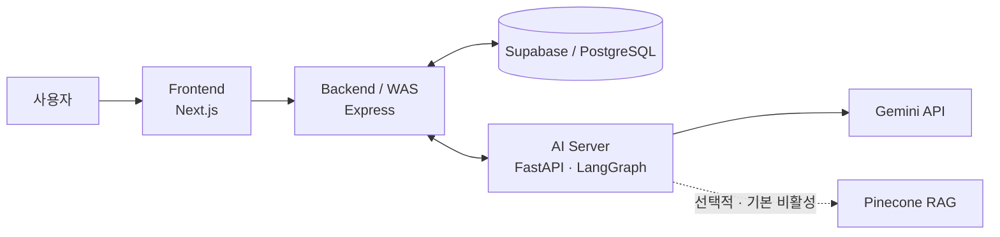

# HealthMate

**AI 기반 개인 건강 상태·성향 맞춤 비의료 생활 건강 코칭 프로토타입**

HealthMate는 건강 상태, 목표, 활동 수준, 알레르기, 부상 이력과 성향 정보를 바탕으로 운동·식단 코칭을 개인화하는 방법을 탐구한 **2026년 대학 심화캡스톤 팀 프로젝트**입니다.

사용자는 `프로필 입력 → 운동·식단 플랜 생성 → AI 채팅에서 수정·승인 → 캘린더 반영` 흐름으로 서비스를 이용합니다.

> HealthMate는 의료 진단·처방 서비스가 아닙니다. AI 응답은 생활 건강 코칭을 위한 참고 정보이며, 의료적 판단이 필요하면 의료 전문가의 진료가 우선합니다.

## 한눈에 보기

- **프로젝트:** AI 기반 개인 맞춤형 운동·식단 코칭 팀 프로젝트
- **핵심 흐름:** 프로필 입력 → 플랜 생성 → 채팅 수정·승인 → 캘린더 반영
- **캡스톤 당시 기여:** LangGraph 구조 공동 설계, FastAPI AI Server 구현 참여, Gemini 연동, 평가 설계·분석, 논문 집필
- **이후 작업:** 보안, 사용자 데이터 격리, runtime privacy·retention, container·deployment·CI 하드닝
- **성과:** 한국정보기술학회 논문 경진대회 은상 수상(팀 연구 성과), 논문 제1저자
- **현재 `main`:** Frontend, Backend, Supabase migrations, AI v1/v2와 GCP 2-VM 배포 설정을 보존한 통합 코드 스냅샷

논문에서 평가한 시스템과 현재 `main`의 코드는 배포 환경, AI 그래프, 기억 경로 등에서 차이가 있으며 완전히 동일한 배포본이 아닙니다.

## 나의 기여

> 캡스톤 당시 Frontend·Backend·AI 전체 시스템이나 AI 구조의 초기 설계와 최종 구현을 한 사람이 단독 수행한 프로젝트가 아닙니다. 전체 AI 구조의 초기 설계는 다른 팀원이 주도했고, 이후 LangGraph 구조와 FastAPI 구현은 공동으로 진행했습니다.

### 캡스톤 당시 팀 기여

- LangGraph 기반 멀티에이전트 구조 공동 설계
- FastAPI 기반 AI Server 구현 참여
- Gemini API 연동과 프롬프트 공동 설계
- Pinecone/RAG 초기 구현 후 팀원에게 인계
- 정상·위험·개인화 평가 시나리오와 판정 기준 설계
- 테스트 진행 방향 수립과 결과 분석
- 관련 연구·선행 사례 조사
- 최종 논문 집필 및 제1저자

FastAPI 구현 과정에서는 생성형 AI를 개발 보조 도구로 활용했습니다.

### 이후 개인 포트폴리오 하드닝

2026년 8월에는 캡스톤 당시 팀 작업과 구분되는 후속 커밋으로 다음을 정리했습니다.

- 추적된 runtime 환경파일·credential 포함 archive 제거와 안전한 template·ignore 규칙 정리
- Backend–AI 인증의 fail-closed 처리와 public·debug surface 기본 제한
- 사용자별 Backend ownership 경계, AI 채팅 checkpoint key 격리, feedback 소유권 검증
- AI TraceStore 최소 수집·보존과 Backend 로그 sanitization·rotation
- GCP 배포 구성의 non-root·read-only container와 SSH·secret 처리 가드레일
- Frontend·Backend·AI·container를 다루는 non-deploy Integration CI 구성
- 기존 팀 커밋과 작성자 이력을 보존한 통합 `main` 정리

이 구분은 원래 캡스톤 구현 전체를 개인 작업으로 보이게 하지 않으면서, 이후 개인적으로 수행한 저장소 하드닝 범위를 보여주기 위한 것입니다.

## 주요 기능

| 기능 | 현재 코드에서 확인되는 범위 |
| --- | --- |
| 계정·프로필 | 회원가입·로그인, JWT 인증, 건강 상태·목표·활동 수준·알레르기·부상·MBTI·AI persona 저장 |
| 운동·식단 코칭 | 사용자 프로필 제약을 반영한 운동·식단 플랜 생성과 결과 검증 |
| AI 채팅 | Express Backend를 경유하는 FastAPI `/chat` 연동과 LangGraph 상태 그래프 |
| 플랜 수정·승인 | 채팅에서 AI 제안을 수정·승인한 뒤 Backend를 통해 저장 |
| 홈·캘린더 | 운동·식단 추천, 수분·활동 위젯, 캘린더형 플랜 조회·수정 |
| 기록·피드백 | 채팅 스레드 조회·삭제와 답변 좋아요·싫어요 피드백 저장 |

## 아키텍처와 코드 범위

기본 요청 흐름은 `Frontend → Express Backend → FastAPI/LangGraph → Gemini API`입니다.

Backend는 인증과 사용자 데이터 경계를 담당하고, AI Server는 프로필 제약을 읽어 생성 전후 검증에 사용합니다. Pinecone/RAG 관련 구현·코퍼스·평가 자산은 보존되어 있지만 기본 비활성이고, 현재 fast graph의 기본 실행 경로에는 연결되지 않습니다.

| 영역 | 위치 | 주요 기술과 역할 |
| --- | --- | --- |
| Frontend | [`develop/frontend-ui`](develop/frontend-ui) | Next.js 16, React 19, TypeScript 5, 인증·온보딩·홈·채팅·캘린더 |
| Backend / WAS | [`develop/backend-api`](develop/backend-api) | Express 4, JWT, Supabase/PostgreSQL, 데이터 저장과 AI 요청 중계 |
| AI v2 | [`develop/ai-model/v2`](develop/ai-model/v2) | Python 3.11 대상, FastAPI, LangGraph, Gemini, 프로필 제약·검증 |
| Database | [`develop/backend-api/supabase/migrations`](develop/backend-api/supabase/migrations) | 추적된 Supabase SQL migrations |
| Deployment | [`develop/deploy/gcp-two-vm`](develop/deploy/gcp-two-vm) | Docker Compose, Caddy, GCP 2-VM 설정, GitHub Actions |

AI v1은 초기 구현 이력으로 보존하며, 현재 통합 경로의 기준은 AI v2입니다. 현재 모델명은 환경변수로 선택하므로 논문에서 사용한 Gemini 2.5 Flash와 동일하다고 간주하지 않습니다.

## 엔지니어링 검증 요약

| 영역 | 현재 `main`의 적용·검사 범위 | 상세 문서 |
| --- | --- | --- |
| 보안 경계 | JWT 기반 사용자 인증, Backend–AI `x-api-key`, 필수 secret fail-closed, 정확한 CORS allowlist, debug route 기본 비활성 | [구현 상세 노트](docs/IMPLEMENTATION_NOTES.md), [로컬 실행 가이드](docs/LOCAL_SETUP.md) |
| 사용자 데이터 격리 | Backend JWT ownership filter, `user_id + session_id` 기반 AI 채팅 checkpoint key, 저장 message를 다시 조회하는 feedback 검증 | [구현 상세 노트](docs/IMPLEMENTATION_NOTES.md) |
| Runtime privacy·retention | 기본 AI TraceStore에서 raw 건강·대화 payload를 보존하지 않고 제한된 summary만 유지, Backend 로그 sanitization·용량 제한, checkpoint 만료 정책 | [구현 상세 노트](docs/IMPLEMENTATION_NOTES.md) |
| Container·Deployment·CI | GCP 배포 profile의 non-root·read-only container, capability drop, SSH host key 검증, secret 없는 non-deploy CI | [GCP 배포 문서](develop/deploy/gcp-two-vm/README.md), [Integration CI](.github/workflows/integration-ci.yml) |

Integration CI의 Frontend browser 검사는 API를 mock하며, Backend와 AI도 contract·fixture·offline 회귀 중심입니다. 따라서 전체 `Frontend → Backend → AI → Supabase` 운영 E2E나 실제 서비스 배포를 입증하지 않습니다.

실제 GCP deployment와 production smoke는 수행하지 않았습니다.

## 논문 평가와 현재 한계

### 논문 평가 결과

다음 수치는 현재 코드의 회귀 테스트가 아니라 **최종 논문에 보고된 제한된 사전 시나리오 기반 예비 평가**입니다.

| 평가 항목 | 평가 범위 | 논문 보고 결과 |
| --- | ---: | ---: |
| 정상 시나리오 | 운동·식단 각 15건 | 30/30 통과 |
| 위험 시나리오 | 부상·심혈관·알레르기·극단 식단 각 5건 | 20/20 거부 |
| 거짓 양성 / 거짓 음성 | 위 50개 안전성 시나리오 | 0건 / 0건 |
| 성격 차별화 | 외향형·내향형 각 2개 프롬프트 | 적합성 0.90 |
| 누적 정보 반영 | 단일 시나리오 10턴 | 정확도 0.90 |

- 조승훈, 박현민, 김찬, 박현성, 이유한, 김승호, 이한용, 「AI기반 개인 건강 상태 및 성향 맞춤 건강관리 서비스 ‘헬스메이트’ 개발」, 2026 한국정보기술학회 하계 종합학술대회 논문집, pp. 1193–1197
- 한국정보기술학회 논문 경진대회 은상 수상(팀 연구 성과)

### 논문과 현재 코드의 차이

| 주제 | 논문에서 설명한 범위 | 현재 `main`에서 확인되는 상태 |
| --- | --- | --- |
| 배포 | Vercel Frontend와 Oracle Cloud 기반 서버 | Vercel·GCP 2-VM 대상 설정 보존 |
| AI 구조 | 검색·답변 평가를 포함한 멀티에이전트 구조 | 프로필 제약과 결과 검증 중심의 fast graph |
| 장기 기억 | Pinecone 기반 의미 검색 | 관련 자산은 남아 있으나 선택적·기본 비활성 |
| 성향 모델 | MBTI와 DISC 결합 | MBTI와 선택형 AI persona는 확인되지만 명시적인 DISC 처리 경로는 확인되지 않음 |
| 모델 | 논문 평가에서 Gemini 2.5 Flash | 환경변수로 모델을 선택하며 논문 시점과 동일성을 보장하지 않음 |

### 현재 한계

- 논문 평가는 제한된 사전 시나리오 기반 예비 평가이며 임상적 안전성이나 실제 건강 개선 효과를 입증하지 않습니다.
- 논문 평가 시스템과 현재 공개 `main`은 AI 그래프·기억 경로·배포 환경에서 차이가 있습니다.
- 현재 CI는 offline·contract·regression 검증 중심이며 실제 GCP production 배포와 전체 운영 E2E는 재검증하지 않았습니다.
- 외부 서비스 가용성, 제품 데이터 lifecycle, 중앙 로그 retention 등은 실제 운영 정책과 별도의 검증이 필요합니다.

의존성 고정, legacy checkpoint, privacy·retention 범위, 외부 연동, 라이선스 등 세부 한계는 [구현 상세 노트](docs/IMPLEMENTATION_NOTES.md)에 기록했습니다.

## 실행·상세 문서·provenance

저장소 루트에는 세 서비스를 한 번에 실행하는 통합 Compose나 실행 명령이 없습니다. 환경변수와 Frontend·Backend·AI Server의 실행 순서는 로컬 실행 가이드를 참고하세요.

- [구현 상세 노트](docs/IMPLEMENTATION_NOTES.md): 논문–코드 차이, 보안 이력, 사용자 데이터 경계, privacy·retention, 검증 범위와 기술부채
- [로컬 실행 가이드](docs/LOCAL_SETUP.md): 서비스별 설정, 환경변수, Supabase 요구사항과 검사 명령
- [GCP 2-VM 배포 문서](develop/deploy/gcp-two-vm/README.md): container·network·deployment contract
- [Integration CI](.github/workflows/integration-ci.yml): non-deploy 검사 구성
- [수동 배포 workflow](.github/workflows/gcp-two-vm-deploy.yml): 실제 배포를 위한 보호된 수동 workflow

이 저장소는 [팀 원본 저장소](https://github.com/WinLike-dev/capstone_2team)를 개인 포트폴리오 관점에서 정리한 Fork입니다. `main`은 기존 팀 커밋과 작성자 이력을 유지하면서 이후 개인 포트폴리오 하드닝을 함께 보존합니다.

현재 저장소에는 별도 오픈소스 라이선스를 부여하지 않았습니다.
