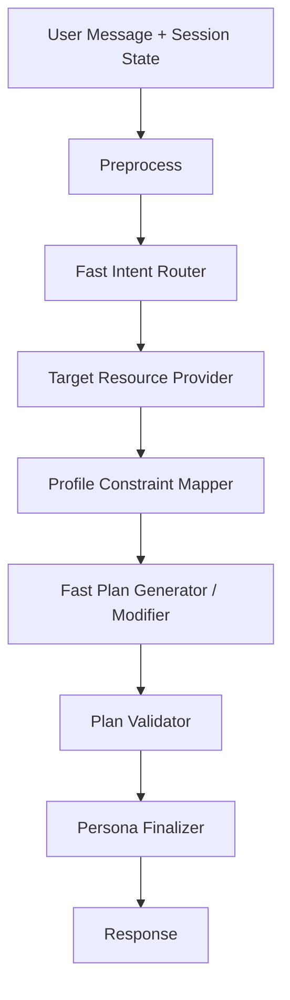

# Plan Routing Decisions

Date: 2026-06-12

## Goal

플랜 생성/수정/승인 흐름에서 속도와 의도 정확도를 우선한다. RAG/Pinecone 검색은 데모 버전에서 제거하고, 날짜/도메인/대상 리소스/승인 여부를 먼저 확정한 뒤 코드 레벨 제약과 validator로 안정성을 잡는다.

## Final Flow

Home recommendation endpoint만 기존 home generator를 유지한다. Chat 경로에서는 search/retrieval/legacy intent/generic generator 노드를 호출하지 않는다.

## Decisions

1. RAG/Pinecone 제거

- Search Node는 LangGraph 실행 경로에서 제외한다.
- Pinecone/Embedding 초기화는 `ENABLE_RAG_MEMORY=false` 기본값으로 비활성화한다.
- Background feedback memory도 Pinecone이 없으면 로그만 남긴다.

2. Intent contract

- Router는 `operation`, `domain`, `target_source`, `target.dates`, `target.meal_slots`, `target.workout_categories`, `commit`을 만든다.
- 날짜는 항상 `YYYY-MM-DD` 배열로 확정한다.
- 운동+식단 동시 요청은 `bundle` proposal로 유지하되, 내부 action은 workout/diet으로 분리한다.

3. Target resource

- `active_proposal`이 있으면 saved planner보다 먼저 참조한다.
- 수정 요청에서는 날짜/도메인 범위 전체를 가져오고, 아침/상체 같은 세부 타겟은 수정 단계에서만 적용한다. 그래야 변경되지 않은 항목이 보존된다.

4. Plan generation

- 식단은 날짜마다 `Breakfast`, `Lunch`, `Dinner` 3개 항목으로 생성한다.
- 운동은 `유산소`, `스트레칭`, `상체`, `하체`, `코어`, `전신`, `휴식` 고정 카테고리를 사용한다.
- `스트레칭`은 절대 `유산소`로 저장하지 않는다.

5. Profile constraints

- 알레르기, 식단 성향, 부상, 지병, 목표, 활동 수준, 가능 시간을 코드 레벨 boundary로 매핑한다.
- ACSM 성격의 운동 기준은 RPE, 세트 수, 세션 크기, 금지 동작으로 전달한다.
- MBTI는 플랜 생성 기준에 사용하지 않는다.

6. Approval/write

- 플랜 생성/수정은 기본적으로 proposal만 만든다.
- 사용자가 승인하면 WAS writer가 저장한다.
- 사용자가 "수정해서 반영해줘"처럼 명확히 말하면 같은 턴에서 수정 후 저장한다.
- "모두 제거해줘 캘린더 내용"은 전체 운동/식단 삭제로 해석한다.

7. Persona

- 페르소나는 최종 문장 스타일만 바꾼다.
- 플랜 날짜, 항목, 금지 조건, 저장 payload는 페르소나가 바꾸지 못한다.
- 현재 매핑: 응원 누나, 다정 동생, 직진 PT쌤, 운동 메이트, 루틴 장인, 생활 매니저.

## Test Labels

정답 레이블은 `develop/ai-model/v2/scripts/test_fast_plan_flow_suite.py` 안의 `EXPECTED_LABELS`에 고정했다.

테스트 범위:

- 10개 사용자 프로필
- 프로필당 10턴
- 총 100턴
- 식단 주간 생성, 아침 수정, 후속 질문, 승인 저장
- 운동 주간 생성, 무릎 부담 수정, 후속 질문, 승인 저장
- 운동+식단 번들 생성
- 캘린더 전체 삭제

최근 결과:

- 결과 파일: `develop/ai-model/v2/fast_plan_flow_results.json`
- 총 100턴 중 100턴 통과
- accuracy: `1.0`
